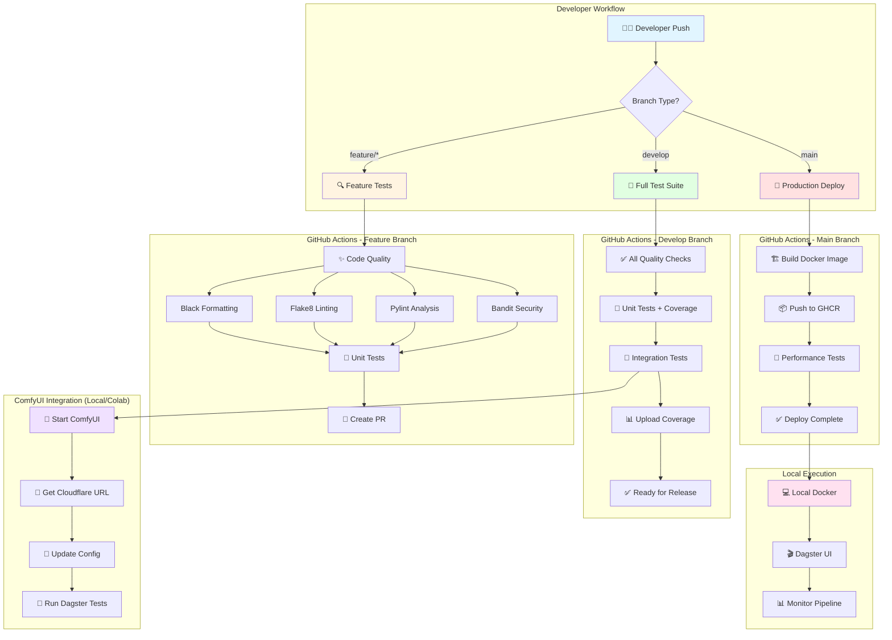
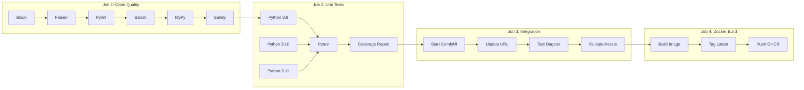
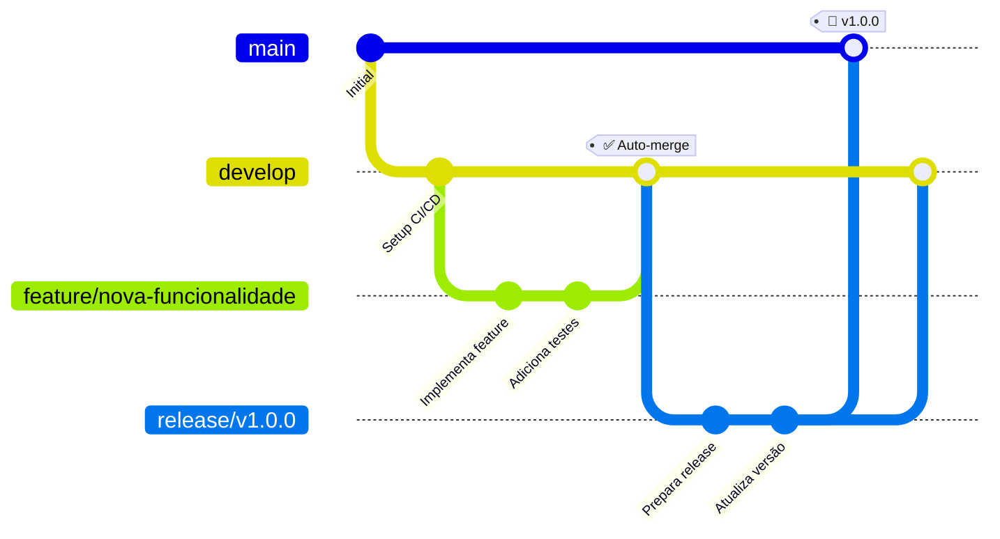
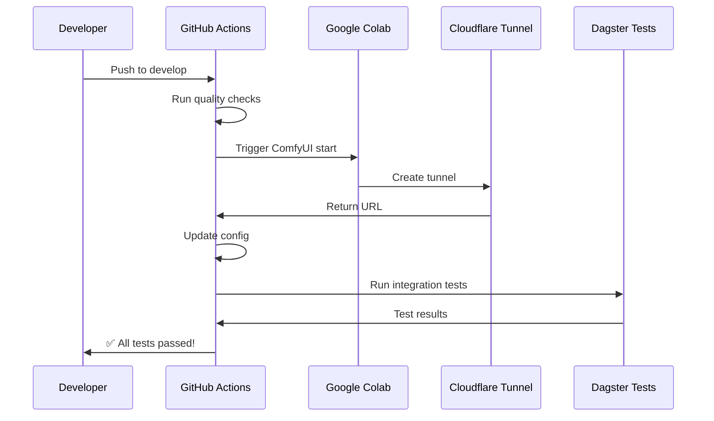

# 🎬 AI Film Pipeline - Dagster + LangGraph

**Pipeline automatizado de produção de filmes com IA usando orquestração híbrida Dagster + LangGraph**

[](https://github.com/seu-usuario/langgraph-mcp/actions)
[](https://github.com/seu-usuario/langgraph-mcp/actions)
[](https://www.python.org/)
[](LICENSE)

---

## 🚀 Visão Geral

O **AI Film Pipeline** é um sistema completo de produção automatizada de filmes com IA que combina:

- 🎨 **Geração de imagens** com ComfyUI e Stable Diffusion
- 🎥 **Processamento de vídeo** com modelos de difusão
- 🎭 **Renderização 3D** com Blender
- 🤖 **Agentes inteligentes** com LangGraph
- 📊 **Orquestração robusta** com Dagster
- 🔄 **CI/CD automatizado** com GitHub Actions

---

## 🏗️ Arquitetura do CI/CD (Sem Cloud)

### **Visão Geral da Arquitetura**

```
┌─────────────────────────────────────────────────────────────────────────────┐
│                          🎬 AI FILM PIPELINE                                 │
│                     Dagster + LangGraph + Kubernetes                         │
└─────────────────────────────────────────────────────────────────────────────┘

┌──────────────┐      ┌──────────────────────────────────────────────────────┐
│              │      │           KUBERNETES CLUSTER (Local/Cloud)            │
│   GitHub     │      │                                                        │
│   Actions    │──────▶  ┌──────────────┐  ┌──────────────┐  ┌────────────┐ │
│              │      │  │   Dagster    │  │   LangGraph  │  │   Flask    │ │
│   CI/CD      │      │  │   Webserver  │  │     MCP      │  │   Upload   │ │
│   Pipeline   │      │  │   Port 3000  │  │   Port 8080  │  │  Port 5000 │ │
│              │      │  └──────────────┘  └──────────────┘  └────────────┘ │
└──────────────┘      │          │                 │                │         │
                      │          └─────────────────┴────────────────┘         │
                      │                          │                            │
                      │  ┌───────────────────────▼──────────────────────┐    │
                      │  │         MICROSERVICES LAYER                   │    │
                      │  │                                                │    │
                      │  │  ┌──────────┐  ┌──────────┐  ┌──────────┐   │    │
                      │  │  │ ComfyUI  │  │ Blender  │  │  FFmpeg  │   │    │
                      │  │  │ Port 8188│  │Port 9876 │  │ Service  │   │    │
                      │  │  └──────────┘  └──────────┘  └──────────┘   │    │
                      │  │                                                │    │
                      │  │  ┌──────────┐  ┌──────────┐  ┌──────────┐   │    │
                      │  │  │ OpenCV   │  │  Redis   │  │PostgreSQL│   │    │
                      │  │  │ Service  │  │  Cache   │  │  Dagster │   │    │
                      │  │  └──────────┘  └──────────┘  └──────────┘   │    │
                      │  └────────────────────────────────────────────────┘    │
                      │                          │                            │
                      │  ┌───────────────────────▼──────────────────────┐    │
                      │  │         PERSISTENT STORAGE                    │    │
                      │  │  ┌──────────┐  ┌──────────┐  ┌──────────┐   │    │
                      │  │  │  Images  │  │  Videos  │  │  Models  │   │    │
                      │  │  │   PVC    │  │   PVC    │  │   PVC    │   │    │
                      │  │  └──────────┘  └──────────┘  └──────────┘   │    │
                      │  └────────────────────────────────────────────────┘    │
                      └────────────────────────────────────────────────────────┘

┌─────────────────────────────────────────────────────────────────────────────┐
│                        EXTERNAL INTEGRATIONS                                 │
│                                                                              │
│  ┌──────────────┐     ┌──────────────┐     ┌──────────────┐               │
│  │ Google Colab │────▶│  Cloudflare  │────▶│   ComfyUI    │               │
│  │   (GPU)      │     │    Tunnel    │     │   Endpoint   │               │
│  └──────────────┘     └──────────────┘     └──────────────┘               │
└─────────────────────────────────────────────────────────────────────────────┘
```

### **Fluxo de CI/CD Detalhado**

```
Developer Workflow:
─────────────────

    ┌─────────┐
    │  Push   │
    │ GitHub  │
    └────┬────┘
         │
         ▼
    ┌────────────┐
    │  Branch?   │
    └─┬────┬────┬┘
      │    │    │
      │    │    └──────────────────┐
      │    │                       │
      ▼    ▼                       ▼
┌──────────┐  ┌──────────┐  ┌──────────┐
│feature/* │  │ develop  │  │   main   │
└────┬─────┘  └────┬─────┘  └────┬─────┘
     │             │              │
     ▼             ▼              ▼
┌──────────┐  ┌──────────┐  ┌──────────┐
│ Linting  │  │Full Tests│  │  Build   │
│  Tests   │  │ Coverage │  │  Docker  │
└────┬─────┘  └────┬─────┘  └────┬─────┘
     │             │              │
     ▼             ▼              ▼
┌──────────┐  ┌──────────┐  ┌──────────┐
│Create PR │  │Integration│  │ Deploy   │
│          │  │  Tests   │  │  K8s     │
└──────────┘  └────┬─────┘  └──────────┘
                   │
                   ▼
            ┌─────────────┐
            │Start ComfyUI│
            │   (Colab)   │
            └──────┬──────┘
                   │
                   ▼
            ┌─────────────┐
            │Get CF URL   │
            │Update Config│
            └──────┬──────┘
                   │
                   ▼
            ┌─────────────┐
            │Run Pipeline │
            │   Tests     │
            └─────────────┘
```

### **Arquitetura Kubernetes (Microserviços)**

```
┌───────────────────────────────────────────────────────────────────┐
│                    KUBERNETES NAMESPACE: ai-film                   │
├───────────────────────────────────────────────────────────────────┤
│                                                                    │
│  ┌─────────────────────────────────────────────────────────┐     │
│  │                    INGRESS CONTROLLER                    │     │
│  │              (nginx-ingress / traefik)                   │     │
│  │                                                           │     │
│  │  ai-film.local  ──▶  Route to Services                  │     │
│  └────────────┬──────────────────────────────────────────────┘     │
│               │                                                    │
│  ┌────────────┴──────────────────────────────────────────────┐   │
│  │                      SERVICES LAYER                        │   │
│  │                                                             │   │
│  │  ┌──────────────┐  ┌──────────────┐  ┌──────────────┐    │   │
│  │  │   dagster    │  │  langgraph   │  │    flask     │    │   │
│  │  │   Service    │  │   Service    │  │   Service    │    │   │
│  │  │ ClusterIP    │  │ ClusterIP    │  │ LoadBalancer │    │   │
│  │  └──────┬───────┘  └──────┬───────┘  └──────┬───────┘    │   │
│  └─────────┼──────────────────┼──────────────────┼────────────┘   │
│            │                  │                  │                │
│  ┌─────────┴──────────────────┴──────────────────┴────────────┐  │
│  │                    DEPLOYMENTS LAYER                        │  │
│  │                                                              │  │
│  │  ┌──────────────┐  ┌──────────────┐  ┌──────────────┐     │  │
│  │  │   Dagster    │  │  LangGraph   │  │    Flask     │     │  │
│  │  │ Deployment   │  │ Deployment   │  │ Deployment   │     │  │
│  │  │ Replicas: 2  │  │ Replicas: 3  │  │ Replicas: 2  │     │  │
│  │  └──────────────┘  └──────────────┘  └──────────────┘     │  │
│  │                                                              │  │
│  │  ┌──────────────┐  ┌──────────────┐  ┌──────────────┐     │  │
│  │  │   ComfyUI    │  │   Blender    │  │    Redis     │     │  │
│  │  │ StatefulSet  │  │ Deployment   │  │ StatefulSet  │     │  │
│  │  │ Replicas: 1  │  │ Replicas: 2  │  │ Replicas: 1  │     │  │
│  │  └──────────────┘  └──────────────┘  └──────────────┘     │  │
│  │                                                              │  │
│  │  ┌──────────────┐  ┌──────────────┐  ┌──────────────┐     │  │
│  │  │  PostgreSQL  │  │    FFmpeg    │  │   OpenCV     │     │  │
│  │  │ StatefulSet  │  │ Deployment   │  │ Deployment   │     │  │
│  │  │ Replicas: 1  │  │ Replicas: 2  │  │ Replicas: 2  │     │  │
│  │  └──────────────┘  └──────────────┘  └──────────────┘     │  │
│  └──────────────────────────────────────────────────────────────┘  │
│                                                                    │
│  ┌──────────────────────────────────────────────────────────┐    │
│  │              PERSISTENT VOLUME CLAIMS                     │    │
│  │                                                            │    │
│  │  ┌──────────┐  ┌──────────┐  ┌──────────┐  ┌──────────┐ │    │
│  │  │ dagster  │  │  images  │  │  videos  │  │  models  │ │    │
│  │  │   -pvc   │  │   -pvc   │  │   -pvc   │  │   -pvc   │ │    │
│  │  │  10Gi    │  │  50Gi    │  │  100Gi   │  │  50Gi    │ │    │
│  │  └──────────┘  └──────────┘  └──────────┘  └──────────┘ │    │
│  └──────────────────────────────────────────────────────────┘    │
│                                                                    │
│  ┌──────────────────────────────────────────────────────────┐    │
│  │                   CONFIGMAPS & SECRETS                    │    │
│  │                                                            │    │
│  │  • comfyui-config     • dagster-config                    │    │
│  │  • postgres-secret    • redis-secret                      │    │
│  │  • api-keys-secret    • cloudflare-secret                 │    │
│  └──────────────────────────────────────────────────────────┘    │
└───────────────────────────────────────────────────────────────────┘
```

### **Fluxo Automatizado Completo**



### **Detalhamento dos Jobs CI/CD**



---

## 🎯 Pipeline de Desenvolvimento

### **GitFlow Automatizado**



---

## 🔄 Fluxo de Trabalho Diário

### **1. Desenvolvimento de Feature**

```bash
# Criar feature branch
git checkout -b feature/minha-feature develop

# Desenvolver
# ... código aqui ...

# Commit e push (triggers CI/CD automaticamente)
git add .
git commit -m "feat: adiciona funcionalidade X"
git push origin feature/minha-feature

# GitHub Actions executa:
# ✅ Linting (2 min)
# ✅ Testes unitários (3 min)
# ✅ Validação de código (1 min)
# Total: ~6 minutos de feedback!
```

### **2. Integração com ComfyUI (Automático)**



---

## 💻 Execução Local (Sem Cloud)

### **Setup Inicial**

```bash
# 1. Clone o repositório
git clone https://github.com/seu-usuario/langgraph-mcp.git
cd langgraph-mcp

# 2. Configure secrets do GitHub
gh secret set COMFYUI_FALLBACK_URL -b "https://sua-url.trycloudflare.com"

# 3. Ative GitHub Actions
# Vá em: Actions > Enable workflows

# 4. Faça seu primeiro push
git checkout -b feature/test-cicd
git push origin feature/test-cicd

# 5. Veja a mágica acontecer! 🎉
```

### **Executar Pipeline Localmente**

```bash
# Opção 1: Docker (Recomendado)
docker build -t ai-film-pipeline -f open3d_implementation/Dockerfile open3d_implementation/
docker run -p 3000:3000 -p 5000:5000 ai-film-pipeline

# Opção 2: Python direto
cd open3d_implementation/orchestration
export COMFYUI_URL="https://sua-url.trycloudflare.com"
python start_dagster_with_upload.py

# Acesse:
# - Dagster UI: http://localhost:3000
# - Upload Interface: http://localhost:5000
```

---

## 🧪 Testes Automatizados

### **Cobertura de Testes**

| Categoria | Ferramentas | Tempo Médio |
|-----------|-------------|-------------|
| **Code Quality** | Black, Flake8, Pylint, Bandit, MyPy | ~2 min |
| **Unit Tests** | Pytest (Python 3.9-3.11) | ~3 min |
| **Integration** | ComfyUI + Dagster | ~5 min |
| **Performance** | Locust, pytest-benchmark | ~3 min |
| **Total** | - | **~13 min** |

### **Executar Testes Localmente**

```bash
# Linting rápido
black --check open3d_implementation/
flake8 open3d_implementation/ --max-line-length=120

# Testes unitários
cd open3d_implementation
pytest tests/ -v --cov=. --cov-report=html

# Testes de integração
python orchestration/test_dagster_integration_final.py

# Ver cobertura
open htmlcov/index.html
```

## 🛠️ Pré-requisitos

- Docker 20.10+ e Docker Compose
- Nvidia Container Toolkit (opcional, para suporte a GPU)
- 16GB+ de RAM recomendado
- 10GB+ de espaço em disco

---

## ⚡ Quick Start

```bash
# 1. Clone e configure
git clone https://github.com/seu-usuario/langgraph-mcp.git
cd langgraph-mcp

# 2. Configure secrets
gh secret set COMFYUI_FALLBACK_URL -b "https://sua-url.trycloudflare.com"

# 3. Primeiro push (triggers CI/CD)
git checkout -b feature/test
git push origin feature/test

# 4. Execute localmente
cd open3d_implementation/orchestration
export COMFYUI_URL="https://sua-url.trycloudflare.com"
python start_dagster_with_upload.py

# 5. Acesse Dagster UI
open http://localhost:3000
```

## 🏗️ Estrutura do Projeto

```
.
├── app/                    # Código-fonte da aplicação principal
│   ├── __init__.py
│   └── main.py             # Ponto de entrada do FastAPI
├── script/                 # Scripts auxiliares
│   └── blender_mcp_addon/  # Plugin do Blender MCP
├── config/                 # Arquivos de configuração
│   └── mcp_config.json     # Configuração principal
├── ComfyUI/                # Instalação do ComfyUI
├── docker/                 # Dockerfiles
├── .env.example           # Exemplo de variáveis de ambiente
├── docker-compose.yml      # Configuração do Docker Compose
├── Dockerfile.optimized    # Dockerfile para produção
├── build_and_deploy.sh     # Script de implantação
└── requirements-app.txt    # Dependências Python
```

## 🌐 Endpoints da API

### Serviços Disponíveis
- `GET /` - Status dos serviços
- `GET /health` - Verificação de saúde

### Blender MCP
- `POST /api/v1/blender/render` - Renderiza uma cena 3D
- `GET /api/v1/blender/status` - Status do serviço Blender

### ComfyUI
- `POST /api/v1/comfyui/generate` - Gera imagens com IA
- `GET /api/v1/comfyui/queue` - Fila de processamento

## 🔧 Desenvolvimento

### Configuração do Ambiente

1. Crie um ambiente virtual:
   ```bash
   python -m venv venv
   source venv/bin/activate  # No Windows: venv\Scripts\activate
   ```

2. Instale as dependências:
   ```bash
   pip install -r requirements-app.txt
   ```

3. Inicie o servidor de desenvolvimento:
   ```bash
   uvicorn app.main:app --reload
   ```

### Testes

```bash
# Instale as dependências de teste
pip install -r requirements-test.txt

# Execute os testes
pytest
```

## 🐛 Solução de Problemas

### Problemas comuns

1. **Falha ao iniciar o Blender**
   - Verifique se o caminho do Blender está correto no `.env`
   - Confira as permissões do diretório de saída

2. **Erros de GPU**
   - Certifique-se de que o Nvidia Container Toolkit está instalado
   - Verifique se o driver da GPU está atualizado

3. **Problemas de memória**
   - Aumente o `shm_size` no `docker-compose.yml`
   - Reduza o tamanho dos lotes de processamento

## 🤝 Contribuição

1. Faça um fork do projeto
2. Crie uma branch para sua feature (`git checkout -b feature/AmazingFeature`)
3. Faça commit das suas alterações (`git commit -m 'Add some AmazingFeature'`)
4. Faça push para a branch (`git push origin feature/AmazingFeature`)
5. Abra um Pull Request

## 📄 Licença

Distribuído sob a licença MIT. Veja `LICENSE` para mais informações.

---

## 📊 Monitoramento e Observabilidade

### **GitHub Actions Dashboard**

Monitore todos os workflows em tempo real:
- **Actions**: https://github.com/seu-usuario/langgraph-mcp/actions
- **Workflows**: Veja status de cada job
- **Logs**: Logs detalhados de cada step
- **Artifacts**: Download de reports e coverage

### **Dagster UI (Local)**

```bash
# Iniciar Dagster
cd open3d_implementation/orchestration
python start_dagster_with_upload.py

# Acesse: http://localhost:3000
```

**Funcionalidades:**
- 📊 Visualização de assets e dependências
- 🔄 Execução manual de pipelines
- 📈 Métricas de performance
- 📝 Logs estruturados
- 🎯 Data lineage completo

---

## 🚀 Próximos Passos

### **Fase Atual: Local + GitHub Actions** ✅
- ✅ CI/CD automatizado
- ✅ Testes em cada push
- ✅ ComfyUI via Colab
- ✅ Execução local com Docker
- ✅ GitFlow organizado

### **Fase Futura: Cloud (Opcional)**
Quando precisar escalar:
- [ ] Deploy GCP com Terraform
- [ ] Cloud Run para Dagster
- [ ] Cloud Storage para outputs
- [ ] Cloud SQL para metadados
- [ ] Monitoramento com Prometheus

---

## 📚 Documentação Adicional

- 📖 **[CICD_SETUP.md](./CICD_SETUP.md)** - Guia completo de CI/CD
- ⚡ **[QUICK_START_CICD.md](./QUICK_START_CICD.md)** - Setup em 5 minutos
- 🏗️ **[open3d_implementation/docs/API_REFERENCE.md](./open3d_implementation/docs/API_REFERENCE.md)** - Referência da API
- 🎬 **[open3d_implementation/README.md](./open3d_implementation/README.md)** - Documentação técnica

---

## 🤝 Contribuição

1. Fork o projeto
2. Crie uma feature branch (`git checkout -b feature/AmazingFeature`)
3. Commit suas mudanças (`git commit -m 'feat: Add AmazingFeature'`)
4. Push para a branch (`git push origin feature/AmazingFeature`)
5. Abra um Pull Request

**Padrão de Commits:**
- `feat:` Nova funcionalidade
- `fix:` Correção de bug
- `docs:` Documentação
- `test:` Testes
- `chore:` Manutenção

---

## 📄 Licença

Distribuído sob a licença MIT. Veja `LICENSE` para mais informações.

---

## 🎓 Recursos e Links Úteis

### **GitHub Actions**
- [Documentação Oficial](https://docs.github.com/en/actions)
- [Marketplace](https://github.com/marketplace?type=actions)
- [Workflow Syntax](https://docs.github.com/en/actions/using-workflows/workflow-syntax-for-github-actions)

### **Dagster**
- [Documentação](https://docs.dagster.io/)
- [Deployment Guide](https://docs.dagster.io/deployment)
- [Best Practices](https://docs.dagster.io/guides/dagster/recommended-practices)

### **LangGraph**
- [Documentação](https://python.langchain.com/docs/langgraph)
- [Examples](https://github.com/langchain-ai/langgraph/tree/main/examples)

### **ComfyUI**
- [GitHub](https://github.com/comfyanonymous/ComfyUI)
- [Custom Nodes](https://github.com/ltdrdata/ComfyUI-Manager)

### **Terraform**
- [GCP Provider](https://registry.terraform.io/providers/hashicorp/google/latest/docs)
- [Best Practices](https://www.terraform.io/docs/cloud/guides/recommended-practices/index.html)

---

## 📧 Contato e Suporte

- 💬 **Issues**: [GitHub Issues](https://github.com/seu-usuario/langgraph-mcp/issues)
- 📖 **Discussions**: [GitHub Discussions](https://github.com/seu-usuario/langgraph-mcp/discussions)
- 📧 **Email**: seu-email@example.com

---

<div align="center">

**⭐ Se este projeto foi útil, considere dar uma estrela!**

Made with ❤️ by [Seu Nome](https://github.com/seu-usuario)

</div>